# Browser-Based Remote File Management API - Task Breakdown

## Task Overview

This document breaks down the development of the browser-based remote file management API into structured, actionable tasks organized by phases.

## Phase 1: Core Infrastructure (Weeks 1-4)

### T1.1 - Basic POSIX JavaScript API
**Description**: Implement core JavaScript API with POSIX-like interface
**Estimated Time**: 1 week
**Dependencies**: None
**Acceptance Criteria**:
- [ ] RemoteFS class with all core methods (mkdir, rmdir, readdir, stat, readFile, writeFile, unlink, chmod, rename)
- [ ] Proper error handling and promise-based API
- [ ] TypeScript definitions
- [ ] Basic unit tests

### T1.2 - Service Worker Implementation
**Description**: Create Service Worker for persistent background operations
**Estimated Time**: 1 week
**Dependencies**: T1.1
**Acceptance Criteria**:
- [ ] Service Worker registration and lifecycle management
- [ ] Background sync capability
- [ ] Message passing between main thread and service worker
- [ ] Offline operation queuing
- [ ] Basic error recovery

### T1.3 - Backend Go Service Foundation
**Description**: Create core Go backend service with HTTP/WebSocket endpoints
**Estimated Time**: 1 week
**Dependencies**: None
**Acceptance Criteria**:
- [x] Go service with Gin framework
- [ ] WebSocket connection handling
- [ ] HTTP/2 support for file transfers
- [x] Request/response message format (JSON)
- [x] Basic logging and error handling

**Progress**: 60% Complete
- ✅ Production-ready Go service structure
- ✅ Configuration management with Viper
- ✅ Structured logging with Zap
- ✅ Health check endpoints
- ✅ Metrics endpoint with Prometheus
- ✅ Middleware stack (CORS, logging, request tracking)
- ✅ Docker support
- ✅ Development tooling (Makefile, hot reload)
- ❌ WebSocket implementation pending
- ❌ File transfer optimizations pending

### T1.4 - File System Storage Adapter
**Description**: Implement file system storage adapter for local/mounted storage
**Estimated Time**: 1 week
**Dependencies**: T1.3
**Acceptance Criteria**:
- [ ] StorageAdapter interface implementation
- [ ] All POSIX operations (mkdir, rmdir, readdir, stat, readFile, writeFile, unlink, rename)
- [ ] Proper error handling and path validation
- [ ] Permission management
- [ ] Basic security checks (path traversal protection)

### T1.5 - Basic WebSocket Communication
**Description**: Establish WebSocket communication between browser and backend
**Estimated Time**: 1 week
**Dependencies**: T1.1, T1.3
**Acceptance Criteria**:
- [ ] WebSocket message protocol implementation
- [ ] Request/response correlation with unique IDs
- [ ] Connection management and reconnection logic
- [ ] Error handling and timeout management
- [ ] Basic integration tests

## Phase 2: Storage Adapters (Weeks 5-8)

### T2.1 - Storage Abstraction Layer
**Description**: Create pluggable storage adapter architecture
**Estimated Time**: 1 week
**Dependencies**: T1.4
**Acceptance Criteria**:
- [ ] Abstract StorageAdapter interface
- [ ] Adapter registry and configuration system
- [ ] Runtime adapter switching
- [ ] Adapter health checking
- [ ] Configuration validation

### T2.2 - Amazon S3 Storage Adapter
**Description**: Implement S3 storage adapter with directory simulation
**Estimated Time**: 1.5 weeks
**Dependencies**: T2.1
**Acceptance Criteria**:
- [ ] S3 SDK integration
- [ ] Directory simulation using object prefixes
- [ ] Multipart upload for large files
- [ ] Proper error handling for S3 operations
- [ ] Configuration management (buckets, regions, credentials)
- [ ] Integration tests with S3 mock

### T2.3 - Kubernetes Volume Adapter
**Description**: Implement Kubernetes volume storage adapter
**Estimated Time**: 1.5 weeks
**Dependencies**: T2.1
**Acceptance Criteria**:
- [ ] Kubernetes client-go integration
- [ ] PVC (PersistentVolumeClaim) operations
- [ ] Volume mounting and unmounting
- [ ] Support for different volume types
- [ ] Proper error handling and retry logic
- [ ] Integration tests with K8s test cluster

### T2.4 - Configuration Management System
**Description**: Create comprehensive configuration management
**Estimated Time**: 1 week
**Dependencies**: T2.1, T2.2, T2.3
**Acceptance Criteria**:
- [ ] YAML/JSON configuration file support
- [ ] Environment variable override
- [ ] Runtime configuration updates
- [ ] Configuration validation
- [ ] Multi-environment support (dev, staging, prod)
- [ ] Secrets management integration

## Phase 3: Advanced Features (Weeks 9-12)

### T3.1 - IndexedDB Local Caching
**Description**: Implement local caching with IndexedDB
**Estimated Time**: 1 week
**Dependencies**: T1.1, T1.2
**Acceptance Criteria**:
- [ ] IndexedDB wrapper with idb library
- [ ] File content caching with metadata
- [ ] Cache invalidation strategies
- [ ] Storage quota management
- [ ] Cache performance optimization
- [ ] Data migration support

### T3.2 - Offline Functionality
**Description**: Implement comprehensive offline capability
**Estimated Time**: 1.5 weeks
**Dependencies**: T3.1, T1.2
**Acceptance Criteria**:
- [ ] Operation queuing for offline scenarios
- [ ] Queue persistence across browser sessions
- [ ] Network status detection
- [ ] Smart cache utilization
- [ ] User feedback for offline state
- [ ] Offline-first operation modes

### T3.3 - Background Synchronization
**Description**: Implement background sync with conflict resolution
**Estimated Time**: 1.5 weeks
**Dependencies**: T3.1, T3.2
**Acceptance Criteria**:
- [ ] Background sync via Service Worker
- [ ] Exponential backoff retry mechanism
- [ ] Conflict detection and resolution
- [ ] Sync progress reporting
- [ ] Partial sync capability
- [ ] Cross-tab synchronization

### T3.4 - Web Worker Integration
**Description**: Implement Web Worker for CPU-intensive operations
**Estimated Time**: 1 week
**Dependencies**: T1.1
**Acceptance Criteria**:
- [ ] Web Worker for file processing
- [ ] File compression/decompression
- [ ] Large file chunking
- [ ] Progress reporting for long operations
- [ ] Worker pool management
- [ ] Fallback for unsupported browsers

## Phase 4: Production Readiness (Weeks 13-16)

### T4.1 - Security Implementation
**Description**: Implement comprehensive security measures
**Estimated Time**: 1 week
**Dependencies**: All previous phases
**Acceptance Criteria**:
- [ ] Token-based authentication
- [ ] Path-based access control
- [ ] Operation-level permissions
- [ ] Input validation and sanitization
- [ ] Rate limiting implementation
- [ ] Audit logging system
- [ ] Security testing and vulnerability assessment

### T4.2 - Performance Optimization
**Description**: Optimize performance across all components
**Estimated Time**: 1 week
**Dependencies**: All previous phases
**Acceptance Criteria**:
- [ ] Connection pooling for backend services
- [ ] Chunked file transfers optimization
- [ ] Compression for text files
- [ ] Caching strategy optimization
- [ ] Memory usage optimization
- [ ] Performance benchmarking and profiling

### T4.3 - Error Handling and Recovery
**Description**: Implement robust error handling and recovery mechanisms
**Estimated Time**: 1 week
**Dependencies**: All previous phases
**Acceptance Criteria**:
- [ ] Comprehensive error classification
- [ ] Automatic retry mechanisms
- [ ] Graceful degradation strategies
- [ ] User-friendly error messages
- [ ] Error reporting and monitoring
- [ ] Recovery procedures documentation

### T4.4 - Documentation and Testing
**Description**: Create comprehensive documentation and testing suite
**Estimated Time**: 1 week
**Dependencies**: All previous phases
**Acceptance Criteria**:
- [ ] API documentation with examples
- [ ] Integration guide for developers
- [ ] Unit test coverage > 80%
- [ ] Integration test suite
- [ ] Performance test suite
- [ ] End-to-end test scenarios
- [ ] Deployment documentation

## Additional Tasks

### T5.1 - CI/CD Pipeline
**Description**: Set up continuous integration and deployment
**Estimated Time**: 3 days
**Dependencies**: T4.4
**Acceptance Criteria**:
- [ ] GitHub Actions or similar CI/CD setup
- [ ] Automated testing on multiple browsers
- [ ] Automated deployment to staging/production
- [ ] Docker containerization
- [ ] Health checks and monitoring

### T5.2 - Monitoring and Observability
**Description**: Implement monitoring and observability
**Estimated Time**: 3 days
**Dependencies**: T4.1, T4.2
**Acceptance Criteria**:
- [ ] Metrics collection (Prometheus/similar)
- [ ] Logging aggregation
- [ ] Alerting system
- [ ] Performance dashboards
- [ ] Error tracking and analysis

### T5.3 - Browser Compatibility Testing
**Description**: Ensure compatibility across major browsers
**Estimated Time**: 2 days
**Dependencies**: T4.4
**Acceptance Criteria**:
- [ ] Chrome, Firefox, Safari, Edge testing
- [ ] Service Worker compatibility testing
- [ ] IndexedDB compatibility testing
- [ ] WebSocket compatibility testing
- [ ] Progressive enhancement implementation

## Task Dependencies Visualization

```mermaid
graph TD
    %% Phase 1
    T1.1["T1.1 - Basic POSIX JavaScript API ❌"]
    T1.2["T1.2 - Service Worker Implementation ❌"]
    T1.3["T1.3 - Backend Go Service Foundation 🟨"]
    T1.4["T1.4 - File System Storage Adapter ❌"]
    T1.5["T1.5 - Basic WebSocket Communication ❌"]

    %% Phase 2
    T2.1["T2.1 - Storage Abstraction Layer ❌"]
    T2.2["T2.2 - Amazon S3 Storage Adapter ❌"]
    T2.3["T2.3 - Kubernetes Volume Adapter ❌"]
    T2.4["T2.4 - Configuration Management System ❌"]

    %% Phase 3
    T3.1["T3.1 - IndexedDB Local Caching ❌"]
    T3.2["T3.2 - Offline Functionality ❌"]
    T3.3["T3.3 - Background Synchronization ❌"]
    T3.4["T3.4 - Web Worker Integration ❌"]

    %% Phase 4
    T4.1["T4.1 - Security Implementation ❌"]
    T4.2["T4.2 - Performance Optimization ❌"]
    T4.3["T4.3 - Error Handling and Recovery ❌"]
    T4.4["T4.4 - Documentation and Testing ❌"]

    %% Additional Tasks
    T5.1["T5.1 - CI/CD Pipeline ❌"]
    T5.2["T5.2 - Monitoring and Observability ❌"]
    T5.3["T5.3 - Browser Compatibility Testing ❌"]

    %% Dependencies
    T1.1 --> T1.2
    T1.2 --> T1.5
    T1.3 --> T1.4
    T1.4 --> T1.5
    T1.4 --> T2.1
    T2.1 --> T2.2
    T2.1 --> T2.3
    T2.2 --> T2.4
    T2.3 --> T2.4
    T1.1 --> T3.1
    T1.2 --> T3.1
    T3.1 --> T3.2
    T3.2 --> T3.3
    T1.1 --> T3.4

    %% Phase 4 Dependencies
    T1.1 & T1.2 & T1.3 & T1.4 & T1.5 & T2.1 & T2.2 & T2.3 & T2.4 & T3.1 & T3.2 & T3.3 & T3.4 --> T4.1
    T1.1 & T1.2 & T1.3 & T1.4 & T1.5 & T2.1 & T2.2 & T2.3 & T2.4 & T3.1 & T3.2 & T3.3 & T3.4 --> T4.2
    T1.1 & T1.2 & T1.3 & T1.4 & T1.5 & T2.1 & T2.2 & T2.3 & T2.4 & T3.1 & T3.2 & T3.3 & T3.4 --> T4.3
    T1.1 & T1.2 & T1.3 & T1.4 & T1.5 & T2.1 & T2.2 & T2.3 & T2.4 & T3.1 & T3.2 & T3.3 & T3.4 --> T4.4

    %% Additional Task Dependencies
    T4.4 --> T5.1
    T4.1 & T4.2 --> T5.2
    T4.4 --> T5.3

    %% Styling
    classDef done fill:#90EE90,stroke:#000;
    classDef inProgress fill:#FFD700,stroke:#000;
    classDef todo fill:#FFB6C1,stroke:#000;
    
    class T1.3 inProgress;
    class T1.1,T1.2,T1.4,T1.5,T2.1,T2.2,T2.3,T2.4,T3.1,T3.2,T3.3,T3.4,T4.1,T4.2,T4.3,T4.4,T5.1,T5.2,T5.3 todo;
```

Legend:
- ✅ Completed
- 🟨 In Progress
- ❌ Not Started

## Success Metrics

### Performance Targets
- [ ] Directory listing: < 100ms (cached), < 500ms (remote)
- [ ] Small file operations (< 1MB): < 200ms
- [ ] Large file uploads: Progress reporting every 100KB
- [ ] System uptime: 99.9%
- [ ] API response time p95: < 500ms

### Quality Targets
- [ ] Unit test coverage: > 80%
- [ ] Integration test coverage: > 70%
- [ ] Security vulnerability scan: 0 critical, < 3 high
- [ ] Browser compatibility: 95% of target browsers
- [ ] Documentation completeness: 100% of public APIs

## Risk Mitigation

### Technical Risks
- **Browser compatibility**: Implement progressive enhancement (T5.3)
- **Network reliability**: Robust retry mechanisms (T3.3, T4.3)
- **Data consistency**: Conflict resolution algorithms (T3.3)
- **Performance**: Chunked transfers and background processing (T3.4, T4.2)

### Project Risks
- **Scope creep**: Strict adherence to phase deliverables
- **Resource constraints**: Parallel development where possible
- **Quality assurance**: Continuous testing throughout development
- **Documentation**: Documentation written alongside code development 